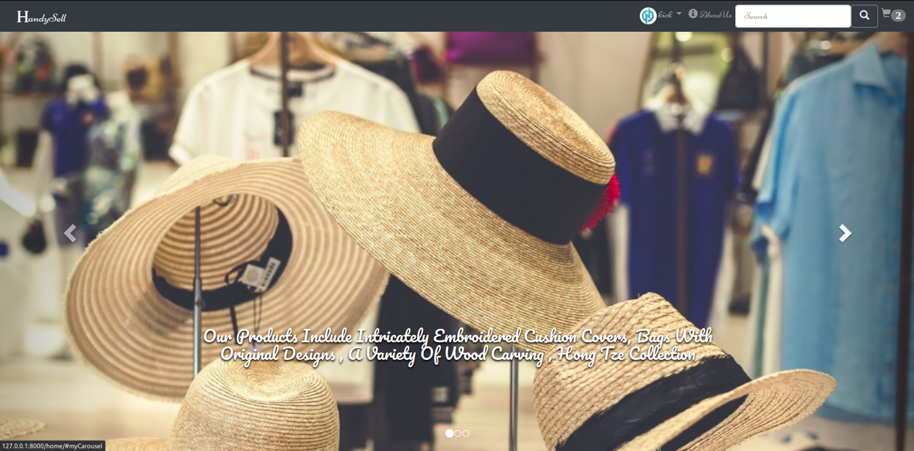

# HandySell-ecommerce

it is created on the virtual environment 
to activate
on linux: "source newdjangoenv/bin/activate"
for windows : "./activate"
then run the Django project.

### The Screen shots are as follows:

more to come...
